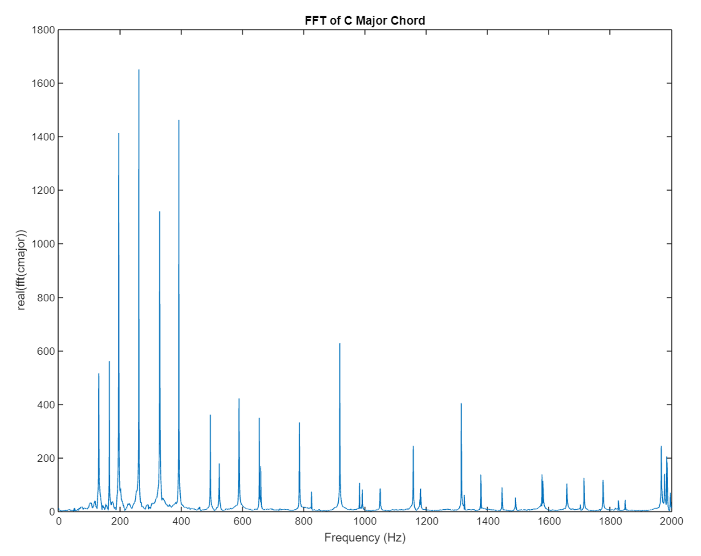
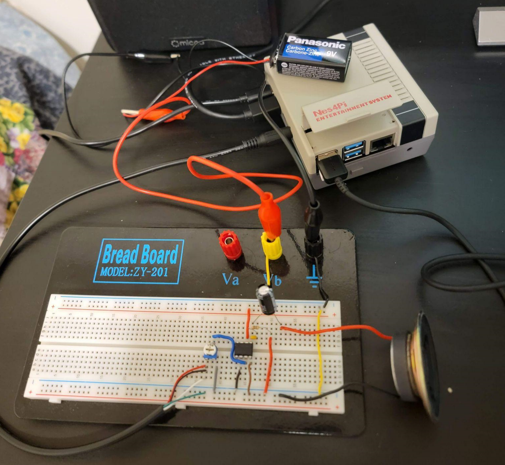

# Melody Improvisation Unit (MIU) 

I completed this in a group of three as a final project for the course ECE446H1: Sensory Communication.

The Melody Improvisation Unit or MIU (μ) is a product that is inspired by a musician’s ability to improvise over a set of chords. MIU aims to improve the music industry with the ability to generate a melody with variations in pitches and rhythms based on a series of input chords, i.e. attempting to simulate a musician’s musical intuitions when creating a line of melody. It provides this melody extemporization through the application of Fast Fourier Transforms (FFTs), digital signal processing (DSP) theories, and melody generation algorithms.

So, the big idea is that the user inputs a chord and MIU then processes it into a new melody. But, how exactly does MIU do this processing? The process is essentially:

1. Digitally generate the chord 
2. Record the signals using DAW software (i.e. Logic Pro)
3. Sort audio data into specific segments
4. Compute FFT and extract dominant frequencies of chord progressions for each segment

FFT of C Major Chord

5. Use frequencies from each segment to generate randomized melody 
6. Combine original chord progression and newly generated melody
7. Play through the speaker

# Design

The implementation of the algorithm to randomize the melody was to take advantage of harmonics, as for instance, the C major scale has notes in common with C harmonics.

The algorithm followed this process:

1. Split the audio data
2. Calculate the segment durations
3. Compute FFTs for each segment
4. Sort and store dominant frequencies
5. Generate random pure tones
6. Store pure tones in a sub-melody vector
7. Append sub-melody vector to the main melody vector
8. Combine and normalize the melody and chord progression

In terms of hardware, we used a **Raspberry Pi 3 Model B**. The process went as:

1. Install the Raspberry Pi OS
2. Upload the code and the user's audio file to the Raspberry Pi 
3. Connect the speaker to the Raspberry Pi output port
4. Run MIU's algorithm
5. Play resulting melody through the speaker

Setup for MIU

Since this was for a school project and we had limited time, some future steps we would take are to:

1. Increase input parameters (allow user to have more flexibility)
2. Implement algorithm in real-time
3. Have a more robust algorithm rather than a randomized algorithm (use AI?)
4. Use a more specialized hardware to increase computation speed
5. 3-D print the exterior to make MIU a portable unit with a speaker

For an overview of the project concept, details, and photos of the setup, please visit [Melody Improvisation Unit](https://markociricilic.com/projects/miu/).

